## 🚀 Deploying to AKS Using GitHub Actions    ☸️⚙️

> I recently built an automated CI/CD pipeline for a microservices-based app, deploying directly to Azure Kubernetes Service (AKS) using GitHub Actions.
>
> 🔗 Project repo: 
```
https://github.com/vsk2404/sample-voting-app
```
>
> This project, the classic Sample Voting App, uses multiple services (Vote UI, Result UI, Worker, Redis, and DB), all containerized and orchestrated using plain Kubernetes manifests.
>
### 🛠️ Key Implementation Highlights:
>
#### ✅ GitHub Actions Workflow
>
> - Triggers on code push to main 
> - Builds Docker images for each service
> - Pushes them to Azure Container Registry (ACR)
> - Applies raw Kubernetes YAML files (kubectl apply) for deployment to AKS

#### ✅ No Helm, No Abstraction
> The entire deployment is driven by straightforward Kubernetes manifests. This gives full control over configuration and is great for learning or fine-tuning deployments at a granular level.

#### ✅ Azure Integration
> Secure authentication with Azure using GitHub Secrets and a Service Principal allows seamless interaction with ACR and AKS from the workflow.

#### ✅ Environment Separation
> Workflows can be easily extended for staging and production environments with separate namespaces and configurations.

### 🔄 CI/CD Flow Overview:

> - Code pushed to GitHub
> - GitHub Actions build & tag Docker images
> - Images pushed to ACR
> - Kubernetes YAMLs applied directly to the AKS cluster

> This setup is simple, transparent, and a solid baseline for any team looking to get started with Kubernetes on Azure — no Helm required.

> 📂 Full code & workflow:
> - 👉 https://github.com/vsk2404/sample-voting-app

### Outputs of project:

#### Azure Subscription

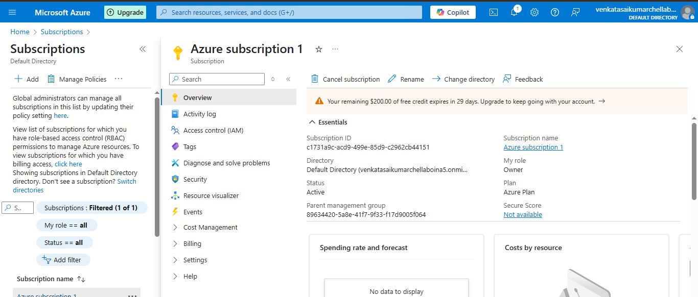

#### Azure Resouce group

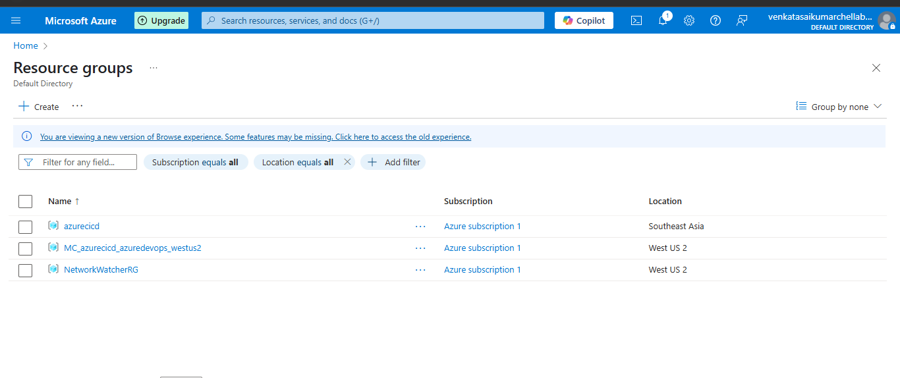

#### Azure Resource

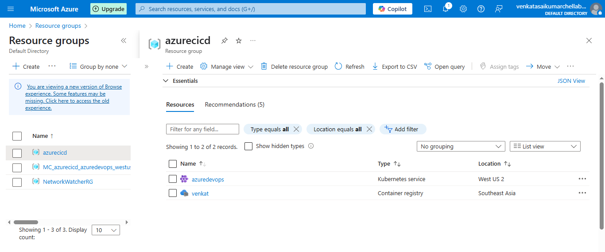

#### Azure ACR:

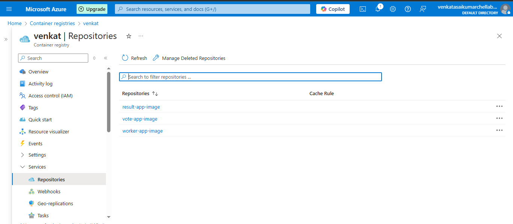

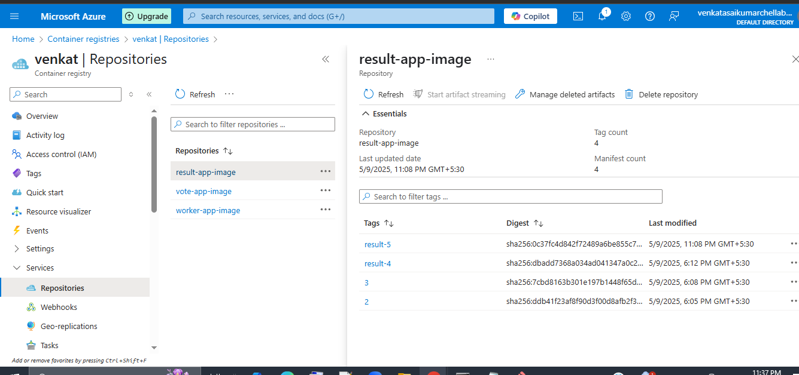

#### Azure CLI:

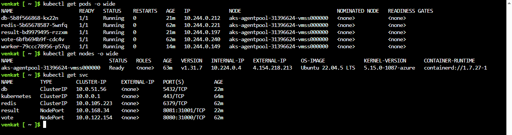

#### Azure K8s namespace

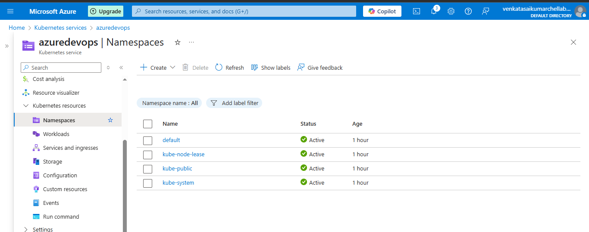

#### Azure K8s service

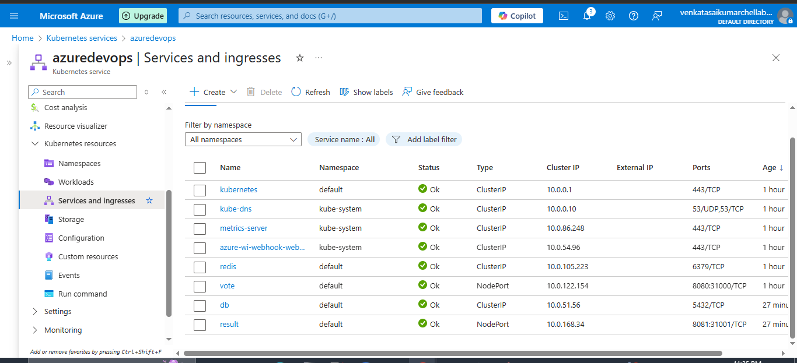

#### Azure K8s pods

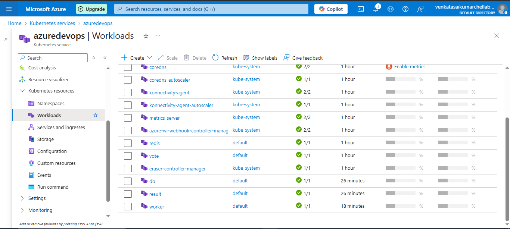

#### Adding secrets in GitHub

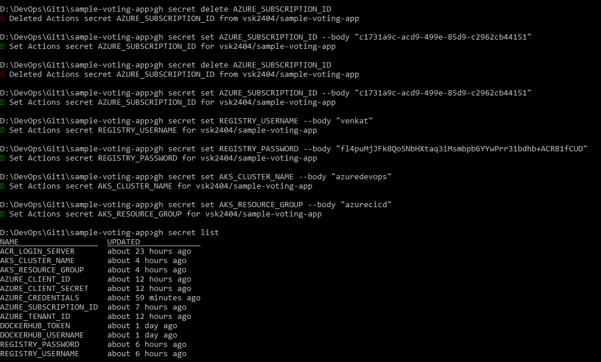

#### Result ui

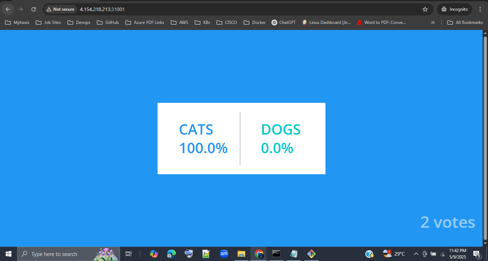

#### Vote ui

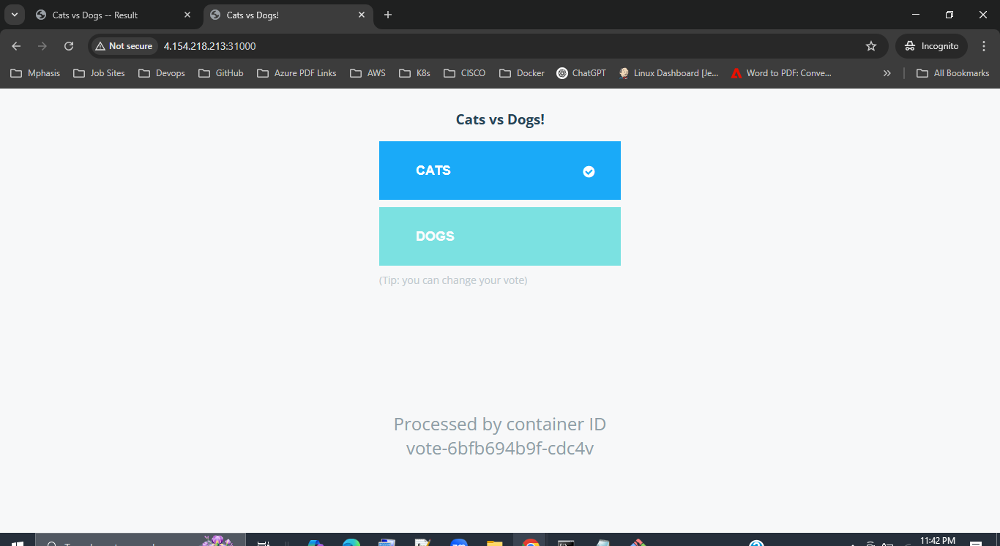

### Note:
> I have copied the project repo from the Docker samples GitHub repo. I have created the GitHub actions workflow files as per the project.

----------------------------------------------------------------------------------------------------------

# sample Voting App

A simple distributed application running across multiple Docker containers.

## Architecture


* A front-end web app in [Python](/vote) which lets you vote between two options
* A [Redis](https://hub.docker.com/_/redis/) which collects new votes
* A [.NET](/worker/) worker which consumes votes and stores them in…
* A [Postgres](https://hub.docker.com/_/postgres/) database backed by a Docker volume
* A [Node.js](/result) web app which shows the results of the voting in real time

## Notes

The voting application only accepts one vote per client browser. It does not register additional votes if a vote has already been submitted from a client.

This isn't an sample of a properly architected perfectly designed distributed app... it's just a simple
sample of the various types of pieces and languages you might see (queues, persistent data, etc), and how to deal with them in Docker at a basic level.